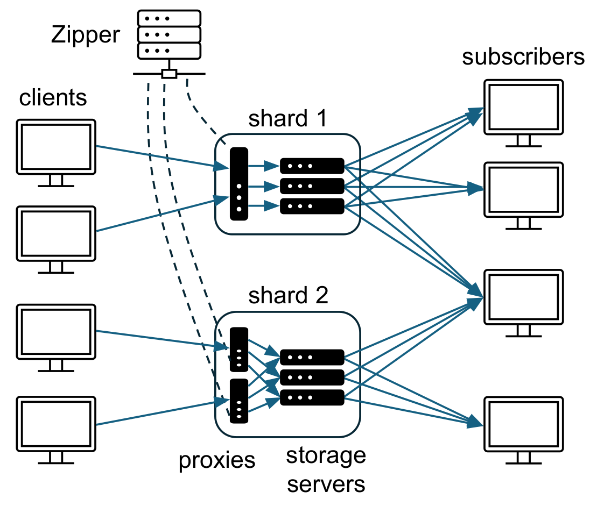

# ZipLog

This repo is the artifact for the RDMA version of Ziplog, a totally ordered shared log.
ZipLog is described in the paper:

**Linearizable Shared Log API Considered Harmful**

Yu-Ju Huang<sup>1</sup>, Shubham Chaudhary<sup>1</sup>, Rafael Soares<sup>2</sup>, Shir Cohen Gahtan<sup>1</sup>, Sabrina Johnson<sup>1</sup>, Arnav Kaul<sup>1</sup>, Lorenzo Alvisi<sup>1</sup>, Luis Rodrigues<sup>2</sup>, and Robbert van Renesse<sup>1</sup>

<sup>1</sup> Cornell University
<sup>2</sup> INESC-ID, Instituto Superior Técnico, Universidade de Lisboa

#  Note
This git repository holds alongside it four other branches, containing:
* The implementation of ZipKVS (`zipkvs` branch) and the Retwis client used to benchmark ZipKVS (`retwis` branch).
* The eRPC version of Ziplog (`ziperpc`) used to evaluate against LazyLog;
* The TCP version of Ziplog (`tcp`) used to evaluate against SpecLog

## Artifact Evaluation

For the artifact evaluation, we have prepared a special Dockerfile containing all branches already compiled and scripts containing local deployments of microbenchmarks to demonstrate functionality.
You can find these instructions in **[docs/ArtifactEvaluation.md](docs/ArtifactEvaluation.md)**

## Requirements

Before building or running ZipLog, make sure you have:

### Software Requirements
- **Linux** — the networking layer is built directly on `libibverbs`/`rdma-core`, which are Linux-only.
- **Root/sudo access** — needed to configure huge pages (below) and, when using Docker, to run the container with elevated privileges for RDMA device access.

### ⚠️ Hardware Requirement: RDMA + mlx5

**This codebase requires a real RDMA-capable network device to run — specifically, it is written and tuned against Mellanox `mlx5` hardware.**

If you don't have access to hardware/a driver that supports XRC queue pairs (in practice, `mlx5`-class RDMA NICs), you will not be able to exercise this codebase's actual networking path.

> **Disclaimer:** the original evaluation in the paper was run on machines with two Intel Xeon Gold 6242 16-core CPUs and 192 GB of DDR4 memory each, equipped with Mellanox ConnectX-4 dual-port NICs connected via a 100 Gbps Mellanox SB7700 InfiniBand switch (4 μs median RTT, sub-1 μs clock sync). Other `mlx5`-class hardware should work, but has not been tested.

## Dependencies

- **Compiler**: `clang++-16` — the project relies on C++20 features and is built exclusively with Clang 16 (see `Makefile`).
- **Build tools**: `cmake`, `make`, `git` (with submodule support), `autoconf` (required to build the vendored `jemalloc` submodule).
- **RDMA**: `libibverbs` (part of `rdma-core`) — the entire networking layer (`zip::network::manager`) is built directly on top of `libibverbs`.
- **NUMA**: `libnuma-dev` — used for NUMA-aware memory allocation of RDMA buffers.
- **zlib**: `zlib1g-dev` — linked into the benchmark clients (`apps/append`, `apps/smr`) for histogram log encoding.
- **Vendored submodules** (fetched via `git submodule`, built automatically as part of the Makefile):
  - [`cxxopts`](https://github.com/jarro2783/cxxopts) — command-line argument parsing for every binary.
  - [`HdrHistogram_c`](https://github.com/HdrHistogram/HdrHistogram_c) — latency histograms in the benchmark clients.
  - [`jemalloc`](https://github.com/jemalloc/jemalloc) — allocator used by the storage server.

### Installing dependencies (Ubuntu/Debian)

```bash
sudo apt install -y \
  cmake \
  build-essential \
  git \
  autoconf \
  libibverbs-dev \
  ibverbs-providers \
  ibverbs-utils \
  rdma-core \
  libnuma-dev \
  zlib1g-dev
```

Huge pages must also be configured, on the host, for RDMA buffer allocation:

```bash
echo 2048 | sudo tee /proc/sys/vm/nr_hugepages
```

This is a host-level kernel setting, so it applies whether you build natively or inside Docker.

## Docker

As an alternative to installing dependencies directly on the host, a `Dockerfile` is provided with every build dependency pre-installed.

**1. Build the image:**

```bash
docker build -t ziplog .
```

**2. Run a container with RDMA access.** The container needs the host's RDMA devices and network stack passed through:

```bash
docker run --privileged --network host -d \
  -v "$(pwd)":/src/ziplog \
  ziplog sleep infinity
```

- `--privileged` exposes `/dev/infiniband/*` inside the container.
- `--network host` lets the container reach the RDMA NIC's IP/interface directly.
- `-v "$(pwd)":/src/ziplog` bind-mounts the repo into the container, overlaying the copy baked into the image, so edits and `make` output are shared with the host.

**3. Enter the container**

```bash
docker exec -it $(docker ps -q -f ancestor=ziplog) bash
```

**4. Verify RDMA visibility** inside the container before running any binary:

```bash
ibv_devices
```

Your device (e.g. `mlx5_0`) should be listed; if it isn't, double-check the huge pages configuration and step 2's flags.

## Building

```bash
make deps && make -j
```

This produces the following binaries directly under `build/`:
- `build/order` — the Zipper server
- `build/storage` — the Storage server
- `build/client` — the append benchmark client
- `build/subscriber` — the subscriber
- `build/lock_service` — the linearizable lock service

Every binary supports `-h`/`--help` to print its full argument list.

## Service Descriptions

ZipLog is made up of four services — the **Zipper**, **storage servers**, **proxies**, and **subscribers** — plus one example application built on top of them. Figure 1 shows how they fit together for a deployment with two shards, each replicated across multiple storage servers:



Clients send requests to proxies, which forward them in FIFO order to the storage servers of their shard. The Zipper measures each proxy's request rate and uses it to pre-assign and deterministically interleave log slots across shards; storage servers then deliver the resulting totally-ordered log to subscribers.

### Zipper (`order`)

- Manages storage servers, proxies, and subscribers.
- Measures each proxy's request rate over fixed time windows ("epochs") to pre-allocate log slots and deterministically interleave them across shards for that epoch.
- Code: `src/order`.

### Storage servers (`storage`)

- Receive append requests from proxies and serve them, in total order, to subscribers.
- Code: `src/storage`.

### Proxies (`client`)

- The main interface for appending records to the log.
- Aggregate client requests and issue them to storage servers at the rate the Zipper expects, in the timely, predictable manner storage servers require.
- Code: `src/client`, which also doubles as a simple append benchmark.

### Subscribers (`subscriber`)

- The main interface for consuming records from the log.
- Receive records from storage servers and interleave them, across shards, according to the Zipper-assigned total order.
- Code: `src/subscriber`.

In addition to these four services, this repository includes one example application built on top of them — a linearizable lock service, in `src/lock_service`, built using a proxy and a subscriber.

## Running Each Module

There are five binaries: `order`, `storage`, `client`, `subscriber`, and `lock_service`. Each takes a different set of arguments (CPU pinning, shard/replica IDs, addresses of the services it connects to, ...).

See **[docs/RUNNING.md](docs/RUNNING.md)** for the full argument reference for every binary, and **[docs/EXAMPLE_DEPLOYMENT.md](docs/EXAMPLE_DEPLOYMENT.md)** for a worked, end-to-end single-machine deployment (an append benchmark and a linearizable lock service, both running on top of a shared `order`/`storage` setup).

# Acknowledgments

This work was co-funded by the European Union through the Lisboa 2030 Programme (ERDF) and by national funds through FCT, I.P., under projects no. 16539, UID/50021/2025, UID/PRR/50021/2025, and LISBOA2030-FEDER-00771200 and under grant UI/BD/153590/2022.